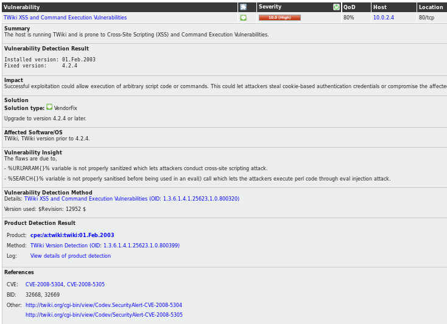
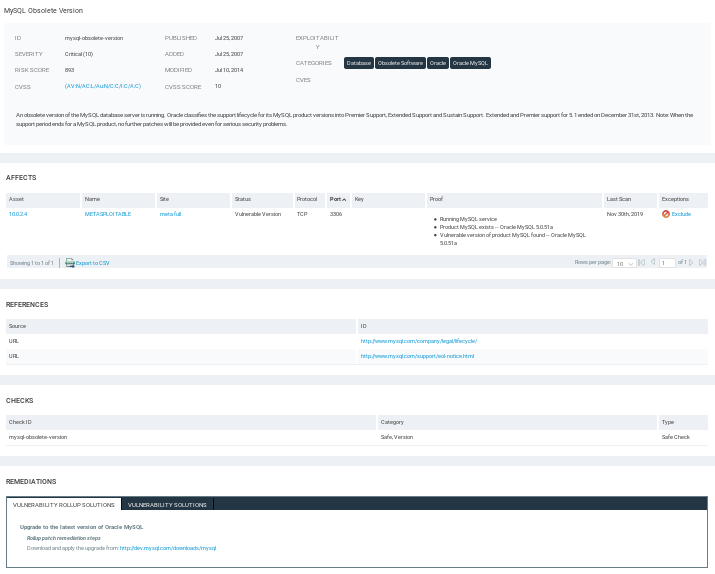

# Evaluation of Nexpose and OpenVAS

## Summary
There are thousands of known security holes in networks, systems and applications. Scanning them for vulnerabilities can assist in detecting a company's exposure to security risks. Vulnerability scanners have made the tedious and tortuous process of discovering risks more manageable.

Two vulnerability scanners that I will be evaluating are Nexpose by Rapid7 and OpenVAS. Both will scan the same system with the Metasploitable virtual machine, an intentionally vulnerable Linux system.

**Nexpose**

Nexpose is made by Rapid7, the same company that created the Metasploit. It is a vulnerability scanner which aims to support the whole vulnerability management lifecycle including impact analysis, reporting and remediation of risks. It is sold as standalone software, a virtual machine, or private cloud deployment. Nexpose has a 30-day free trial. After that, there is a yearly fee starting around $2000.

**OpenVAS**

OpenVas is a free and open-source vulnerability scanner that was forked out from the last free version of another vulnerability scanner called Nessus which went private in 2005. Plugins of OpenVAS are still written in the Nessus NASL language.

## Installation

**Nexpose**

Nexpose installation and setup is slightly complicated. It requires registration and download directly from Rapid7's website.

    chmod u+x ./Rapid7xxx.bin
    ./Rapid7xxx.bin

After running the Rapid7xxx.bin installer, then another hour of setup and activation before presented with the web interface: https://localhost:3780.

    service postgresql stop
    cd /opt/rapid7/nexpose/nsc
    ./nsc.sh

**OpenVAS**

Installation of OpenVAS on an Ubuntu Linux is quick and easy with the command line:

    sudo apt install openvas

Then a web interface is provided at https://127.0.0.1:9392/

## Comparison

Features | **OpenVAS** | **Nexpose**
---------|-------------|------------
vulnerabilities found: | 396 | 287

Both have many templates for reporting.

Results are organized by severity.

In OpenVAS, for each vulnerability, a summary, version, impact, solution, affected software/OS, vulnerability insight, vulnerability detection method, product detection result, and references.

Nexpose has similar output.

## Notes

Installation and setup of Nexpose were not as simple as OpenVAS. It requires more resources to install, RAM and storage. It is also dependent on Java Runtime Environment. It is quite buggy and breaks easily. I had to install it 4 or 5 times after running a scan.

Nexpose activation key is needed. Activation takes about 15 minutes. The whole installation setup and activation takes about 1 hour.

